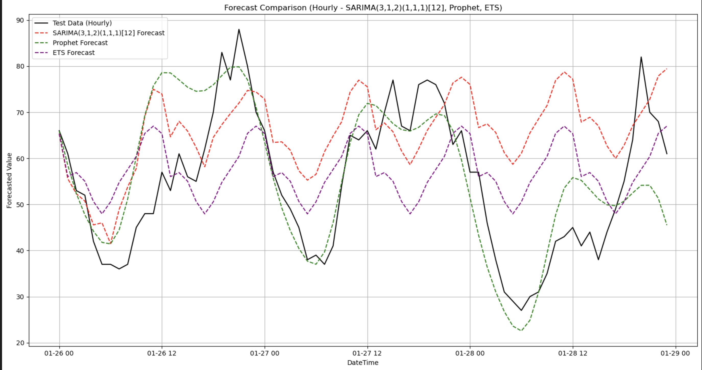

# Time Series Forecasting for Urban Traffic

 **Project by Rani Herbawi, Almog Ben Simon, Tzuf Bachor**  
 **Technion – Israel Institute of Technology**  
 ranykhirbawi@campus.technion.ac.il
 
**Short-term traffic forecasting at an urban junction using classical time-series models and deep learning, with exogenous weather signals and change-point analysis.**

  <a href="Time_Series_Forecasting_Urban_Traffic.pdf"><b>📄 Read the Full Report (PDF)</b></a>

---

## Overview

This project explores advanced time series analysis techniques to forecast **hourly urban traffic volume** at a key junction using real-world sensor data. The study compares traditional statistical models with modern machine learning approaches and evaluates the role of exogenous variables like temperature and change-point detection in improving forecasting accuracy.

---

## Problem & Motivation

Urban planners and mobility teams need reliable short-horizon forecasts to optimize signals, staffing, and incident response. This project builds and compares forecasting models for hourly vehicle volume at a key junction, and studies how temperature and structural shifts affect predictive accuracy.

---

  

---

##  Models Used

| Model          | Type                  | Strengths                            |
|----------------|-----------------------|--------------------------------------|
| SARIMA         | Statistical            | Strong seasonal trend modeling       |
| Prophet        | Additive model (Meta)  | Intuitive, robust, minimal tuning    |
| Holt-Winters    | Exponential Smoothing | Lightweight, interpretable baseline  |
| LSTM           | Deep Learning (RNN)   | Captures long-term dependencies      |

---

##  Methods

- **Classical:** SARIMA / SARIMAX, Holt-Winters (ETS)
- **Modern:** Prophet (Meta), LSTM (uni- and multivariate)
- **Validation:** Fixed train window (first 600 hours) + held-out test (last 72 hours); forward-chaining for iterative models where relevant.
### Additional analyses
- **Exogenous variable:** Ambient temperature (Kelvin) added to SARIMAX, Prophet, and multivariate LSTM.
- **Change-point detection:** Interrupted Time Series Regression (ITSR) to detect level/slope shifts.

---

##  Dataset

- **Source**: Kaggle [ML-IoT Traffic Dataset](https://www.kaggle.com/datasets/vetrirah/ml-iot/data)
- **Content**: Hourly vehicle counts from four urban junctions and temperture data.
- **Focus**: Junction 1 (highest variability and volume)

---

## Exogenous Variable Analysis (Tel Aviv district)

- **Variable**: Ambient temperature (in Kelvin)
- **Pearson correlation** with traffic ≈ 0.45 (moderate).
- **Findings**:
  - **SARIMAX** improved RMSE 17.31 → 15.43; **Prophet** slight gain 10.40 → 10.29; **LSTM** degraded when multivariate.

---

## Change-Point Detection (ITSR)

- Method: **Interrupted Time Series Regression (ITSR)**
- Detected a structural shift on **January 16, 2017 at 12:00**
- Result: Significant level shift (+12 vehicles/hour) and trend reversal post-change (significant p-values)

---

## Performance Metrics

| Model         | MAE   | RMSE  | AIC       |
|---------------|-------|-------|-----------|
| Prophet       | 7.84  | 10.39 | –         |
| SARIMA        | 10.18 | 13.73 | 3333.26   |
| ETS           | 10.44 | 14.06 | 1907.94   |
| LSTM (Univariate) | –     | 8.24  | –         |
| LSTM (Multivariate) | –     | 11.93 | –         |

---

## Visual Highlights

### Forecast comparison

  

Prophet most closely tracks spikes/drops on the hold-out set.

### Exogenous temperature improves SARIMAX

  

Adding temperature reduces RMSE for SARIMAX; mild gain for Prophet; harms LSTM with limited data. 
---

